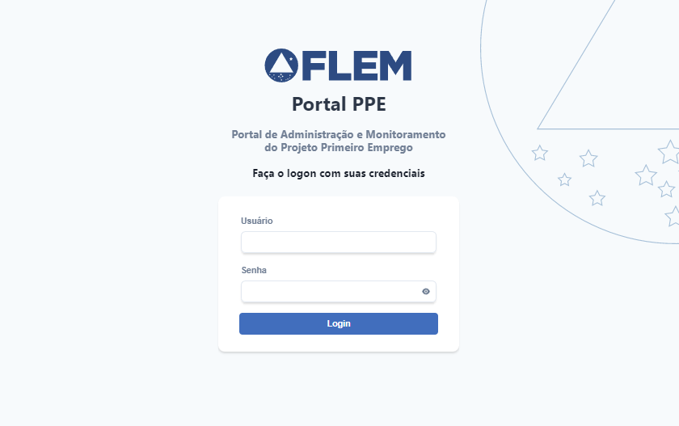

<div align="center">

</div>

<h1 align="center">Portal PPE - Frontend</h1>
<p align=center><i align="center">Aplicação Frontend para o Projeto Primeiro Emprego, da FLEM</i></p>

<br>

<div align="center">

<a href="https://reactjs.org"></a>
<a href="https://nextjs.org"></a>
<a href="https://chakra-ui.com"></a>

<a href=""></a>
<a href=""></a>
<a href=""></a>

<a href=""></a>
<a href=""></a>
<a href=""></a>

<a href=""></a>
<a href=""></a>
<a href="https://github.com/frtechdev/flem-ppe-frontend/blob/main/LICENSE"></a>

|| [Conteúdo](#section-conteudo) || [Características](#section-caracteristicas) || [Stack](#section-stack) || [Documentação](#section-documentacao) || [Instruções](#section-instrucoes) ||

|| [Variáveis de Ambiente](#section-vars) || [Notas de versão](#section-changelog) || [Autores](#section-autores) || [Contato](#section-contato) || [Licença](#section-licenca) ||

</div>

<hr>

<a name="section-conteudo">

## Conteúdo

</a>

<br>

Essa aplicação tem como função servir de Frontend para o Portal Primeiro Emprego, um novo conceito de sistema que integra funcionalidades, hoje separadas, de um dos serviços essenciais do cliente (FLEM).

<hr>

<a name="section-caracteristicas">

## Características

</a>

<br>

- Os sistemas relacionados ao PPE usarão uma única linguagem centrada, no Frontend e Backend: o Javascript, além do mesmo framework para Banco de Dados e mesma estrutura de arquitetura, seguindo mesmo estilo de codificação e integração, permitindo um ambiente harmônico visualmente e estruturalmente
- Recriação da API de integração com Bancos de Dados não-FLEM (ex., Domínio), de fácil modularização, facilitando a manutenção dessa relação e possibilitando facilmente a adaptação a outros Bancos de Dados
- Estrutura homogênea e documentada, alinhada a fluxos de atualização, modificação e melhorias mais rápidas, eficazes e com menor tempo de espera para cumprimento das demandas
- Layout altamente responsivo, com os princípios modernos da Modelagem UI/UX seguindo o Desenvolvimento “Mobile First” para melhor experiência de usuário
- Sistema implementado por dockerização e modularização, alinhados a sistemas de deploy de tempo real baseado no padrão GIT de Sistemas de Controle de Versão, facilitando a reversão e evolução do Software, com fácil atualização devido ao uso de JavaScript como linguagem base
- Criação de um único dashboard – um portal central – contendo todos os sistemas que dependem e cruzam diretamente com as informações do PPE (como por exemplo, SMB e SIGPE). Preferencialmente, esse design será utilizado em outros portais para outros sistemas no futuro se for necessário, criando um ambiente computacional de fácil assimilação e reduzindo tempo necessário para execução de processos triviais

<hr>

<a name="section-stack">

## Stack

</a>

<br>

- **Linguagem Principal:** [Javascript](https://developer.mozilla.org/pt-BR/docs/Web/JavaScript)
- **Linguagens de Marcação e Estilo:** [HTML](https://developer.mozilla.org/pt-BR/docs/Web/HTML), [CSS](https://developer.mozilla.org/pt-BR/docs/Web/CSS), [SASS](https://sass-lang.com/documentation)
- **Framework Principal:** [Node.js](https://nodejs.org/en/docs/)
- **Framework estrutural:** [Next.js](https://nextjs.org/docs/getting-started)
- **Design System:** [Chakra UI](https://chakra-ui.com/docs/getting-started)
- **Gerenciador de Dependências:** [Yarn](https://yarnpkg.com/getting-started)
- **Bibliotecas:** Para uma lista completa de bibliotecas e dependências nos mais variados escopos, conferir o arquivo [package.json](https://github.com/frtechdev/flem-ppe-frontend/blob/main/package.json).

<hr>

<a name="section-documentacao">

## Documentação

</a>

<br>

- [Roadmap (Módulo SIGPE)](https://miro.com/app/board/uXjVPWCiaDo=/?share_link_id=713196550342)

- [Roadmap (Módulo SMB)](https://miro.com/app/board/uXjVOMzAe7s=/?invite_link_id=872842801580)

- [Modelo Conceitual de Fluxo de Cadastramento de Beneficiários](https://miro.com/app/board/uXjVONgTB50=/?invite_link_id=986301656145)

- [Diagrama de Macroprocessos](https://miro.com/app/board/uXjVOOJxdWc=/?invite_link_id=184583999527)

- [Mapa de Macroprocessos](https://miro.com/app/board/uXjVOOroXvA=/?invite_link_id=576187018086)

- [Manual do Usuário](https://frtechdev.github.io/flem-ppe-frontend/resources/portalppe_manual_do_usuario.pdf)

- [Manual de Testes](https://frtechdev.github.io/flem-ppe-frontend/resources/portalppe_manual_de_testes.pdf)

- [Checklist de Validação de Testes](https://frtechdev.github.io/flem-ppe-frontend/resources/portalppe_checklist_de_validacao.xlsx)

Documentação adicional pode ser encontrada [aqui](https://frtechdev.github.io/flem-ppe-frontend/).

Para documentação pertinente a outros elementos da arquitetura não mencionados neste documento, acesse a documentação Backend clicando [aqui](https://frtechdev.github.io/flem-ppe-backend/).

<hr>

<a name="section-instrucoes">

## Instruções

</a>

<br>

### Utilizando o repositório como projeto

</a>

1 - Faça um git clone ou o download do repositório, da forma que preferir

```bash

git clone https://github.com/frtechdev/flem-ppe-frontend.git

```

2 - Instale um gerenciador de pacotes (preferencialmente yarn) utilizando um terminal no diretório raiz do repositório clonado

`yarn` ou `npm install`

3 - Execute a aplicação no terminal

`yarn dev` ou `npm run dev`

### Implantando o projeto

</a>

#### Por um repositório clonado

**Lembre-se de executar `yarn build` ANTES de criar seu container com base no repositório local.**

Para criar a imagem, utilize o `docker build` referenciando o arquivo local do [Dockerfile](https://github.com/frtechdev/flem-ppe-frontend/blob/main/Dockerfile):

```bash
docker build - < Dockerfile
```

#### Diretamente do repositório remoto

Você pode utilizar o `docker build` referenciando diretamente o repositório:

```bash
docker build https://github.com/frtechdev/flem-ppe-frontend.git#main
```

Alternativamente, pode usar o comando detalhado para alterar diretamente configurações como porta e nome do repositório:

```bash
docker run -p X:3000 -e github='https://github.com/frtechdev/flem-ppe-frontend.git' -it frtechdev/flem-ppe-frontend
```

Onde "X" é uma porta externa de sua escolha. Por padrão, a porta interna é 3000.
Para alterar a porta interna, altere a linha `ENV PORT` do [Dockerfile](https://github.com/frtechdev/flem-ppe-frontend/blob/main/Dockerfile).

Para mais informações, visite a [Documentação do Docker](https://docs.docker.com).

</a>

<hr>

<a name="section-vars">

### Variáveis de Ambiente

</a>

<br>

| Variável      | Uso   |
|---------------|-------|
|`NEXT_PUBLIC_APP_SOURCE` | Nome da aplicação. Necessário para indexar os arquivos na API de Upload de Arquivo (padrão: "Portal_PPE") | |
|`NEXT_PUBLIC_API_PPE_BACKEND` | Define o endereço da API Backend do Portal PPE | |
|`NEXT_PUBLIC_API_PPE_BD_LEGADO` | Define o endereço da API de acesso ao BD Legado | |
|`NEXT_PUBLIC_API_FILE_UPLOAD` | Define o endereço da API de Armazenamento de Arquivos  | |
|`NEXT_PUBLIC_API_MAIL_SENDER` | Define o endereço da API de Email  | |
|`NEXT_GOOGLE_API_MAPS_KEY` | Define a chave de API para utilizar os recursos da [API do Google Maps](https://developers.google.com/maps/documentation/distance-matrix/get-api-key)  | |
|`NEXT_PUBLIC_LDAP_URI` | Define o endereço do servidor de Domínio do AD para autenticação da API de login via AD  | |
|`NEXT_PUBLIC_LDAP_BASE_DN` | Define um ponto de busca pelas credenciais dentro da organização ou OU  | |
|`NEXT_PUBLIC_LDAP_USERNAME` | Define o nome de usuário da autenticação  | |
|`NEXT_PUBLIC_LDAP_PASSWORD` | Define a senha da autenticação | |

<hr>

<a name="section-changelog">

## Notas de versão

</a>

<br>

### v1.1.0-230623

- Features
  - Inclusão dos recursos do Módulo SMB - Sistema de Monitoramento de Beneficiários à Aplicação Frontend
  - Merge e Rebase do conteúdo anterior de `main` e `feature`
  - Criação de um script de Github Actions para Tag e Release automáticos das versões no branch `main`
  - Adição de um script de Github Actions para deploy automático de imagem Docker
  - Adição de script de limpeza de index de cache do Git
  - Adição do arquivo `.yarnclean` para sanitização de módulos
  - Documentação de todos os componentes, módulos, arquivos e componentes do projeto
  - Criação de Handler para tratamento de Exceções e resposta para o usuário
  - Inclusão de botão de retorno no processo de importação de planilha de beneficiários
  - Inclusão de loader durante seleção manual de arquivo na dropzone de importação de planilha de beneficiários

- Alterações
  - Atualização do README
  - Alteração nas configurações principais do JSDOC
  - Alteração na data contina no arquivo de Licença
  - Alteração nas rotas padrão em `next.config.js` para direcionar à página de documentação API do projeto
  - Adição dos scripts de push do Docker Build para o Github Container Repository, e do script de autoclean do Yarn
  - Remoção dos arquivos relacionados ao Prisma Schema e ao Banco de Dados
  - Remoção de Controllers não utilizados
  - Remoção e refatoração do backend e restruturação para aplicação Backend específica
  - Implementação de arquivo necessário para execução e remanejamento da home page da documentação API do projeto

- Outros
  - Adição de Regra para exceção de dependências de hook exaustivas em linting (react-hooks/exhaustive-deps)
  - Adição de template de Planilha de Importação e configurações do VSCode ao GITIGNORE
  - Sanitização de dependências

### v1.0.4-221213

- Efetuado correção na lógica do cálculo dos períodos dos trimestres, baseado na data atual.

### v1.0.3-221206

- Efetuado criação das rotas de API:
  - beneficiarios/dashboard;
  - monitoramento/dashboard;
  - eventos/dashboard/presencas;
  - formacoes/dashboard;
  - remessassec/dashboard;
  - territoriosidentidade/dashboard;

- Efetuado atualização dos componentes:
  - BarChart;
  - PieChart;

- Efetuado atualização dos componentes:
  - LineChart: adequado componente para receber props com label e select Element;
  - FormBox: adicionado restante das props enviadas para o input Select;

- Efetuado atualização das páginas:
  - beneficiarios/[idBeneficiario]: alterados os campos de “celular” para “telefone”;
  - dashboard/index: finalização da dashboard com os gráficos sugeridos anteriormente pela equipe FLEM;
  - relatorios-monitoramento/index: removidos itens comentados sem uso;

- Efetuado atualização das rotas de API:
  - beneficiarios/[idBeneficiario]: alterados os campos de “celular” para “telefone”;
  - eventos/presenca: incluido o eventoId na query para ser associado ao criar entrada na tabela de lista de presença;

- Efetuado atualização dos utils:
  - dynamicSort: inserida opção para classificar array por Number ou String;
  - calcularPeriodoMonitoramentoUtil: refatorada a lógica para calcular o primeiro trimestre, que compõe o último mês do ano e os dois primeiros do ano seguinte;

### v1.0.2-221120

- Efetuado criação das páginas:
  - relatorios-monitoramentos;
  - relatorios-monitoramentos/por-beneficiario;
  - relatorios-monitoramentos/por-demandante/sintese;
  - relatorios-monitoramentos/por-demandante/geral;

- Efetuado criação das rotas de API:
  - demandantes;
  - monitoramento/realizados;

- Efetuado atualização dos componentes:
  - sidebarData: removido itens sem uso, adicionado navegação para os relatórios;

- Efetuado atualização das páginas:
  - eventos: alterado parâmetro da quer string para obter a lista de presença do evento;

- Efetuado atualização das rotas de API:
  - reports: efetuado readequação da rota para mesclar as páginas em orientações diferentes em um único arquivo;

### v1.0.1-221017

- Criação das tabelas no schema.prisma:
  - Ba_Monitoramentos;
  - Ba_ Monitoramentos_Comprovações;

- Criação dos componentes:
  - IndeterminateCheckbox;

- Criação das páginas:
  - Monitoramento;

- Criação das rotas de API:
  - monitoramento;
  - monitoramento/anexarComprovacao;
  - network-time;

- Criação dos Services:
  - timeNtpService;

- Criação dos Utils:
  - calcularPeriodoMonitoramentoUtil;

- Modificação das tabelas no schema.prisma:
  - Ba_Demandantes: adicionadas foreign keys;
  - Ba_ Ba_Beneficiários: adicionadas foreign keys;
  - Ba_Monitores: adicionadas foreign keys;

- Modificação dos componentes:
  - Dropzone: adicionado props e render condicional para estado disabled;
  - FormBox:
    - atualizados hooks defaultValue para disparar o trigger;
    - atualizado options para receber a proposta disabled;
  - FormSwitch: adicionada função handleOnChange para exportar o evento;
  - SelectInputBox: atualizado hook para definir o valor via defaultValue;
  - MenuIconButton: atualizado condição para renderização dos botões;
  - Table: atualizado componente para possibilitar selecionar linhas na tabela, por meio de coluna definida na renderização da mesma;

- Modificação do sidebarData:
  - Adicionado rotas para página de Monitores e Monitoramento;

- Modificação das páginas:
  - idBeneficiário: alterado as labels para os status Contratado e Desligado;
  - beneficiários:
    - alteradas as labels para os status Contratado e Desligado na tabela;
    - alterada a condicional para o contador de resultados;
  - monitores:
    - adequado o cadastro de monitores para realizar consulta à API do Domínio Folha;
    - adicionado vinculação de demandantes aos monitores, conforme solicitado pelo cliente;
  - situações-vaga: desabilitado o botão para adicionar tipo de situação de vaga;

- Modificação das rotas de API:
  - demandantes: incluído join com a tabela de vagas;
  - monitores: readequado rota para possibilitar consultar e manipular os dados por escritório regional e/ou demandantes;
  - unidades-lotacao: readequado rota para possibilitar consultar os dados por escritório regional, município ou demandantes;

### v1.0.0-221208

- Atualização da Documentação;
- Update do NextAuth para resolução de segurança;

### v0.0.34-221208

- Remoção do CHANGELOG e inclusão das suas informações no README
- Atualização do prisma schema;
- Atualização da documentação;
- Reorganização dos serviços de API e centralização com um arquivo index;
- Remoção de componentes de teste dentro da estrutura do projeto;
- Transcrição das rotas de API Backend para uma função de aquisição dinâmica de rota;
- Remoção de utilitário duplicado;

### v0.0.33-220916

- Efetuadas as seguintes alterações na tela do Beneficiário:
  - Modificado o campo “Eixo de Formação” na aba Formação, para que seja preenchido automaticamente ao selecionar a formação;
  - Adicionado campo de observação ao lado dos campos de e-mail e telefone, na aba “Dados”, para que possa ser acrescentado uma observação a cada número ou e-mail adicionado;
- Efetuada alteração na rota de API que atende a página do Beneficiário, para armazenar o campo de observação dos contatos;
- Efetuada atualização do componente FormBox: adicionado prop “onChange”, para executar ação ao alterar o valor do campo;
- Atualizado o prisma.schema: adicionado a coluna observação na tabela Ba_Contatos_Beneficiarios;

### v0.0.32-220915

- Corrigido rota de API de importação de beneficiários para criar um beneficiário, ou atualizar caso o mesmo já exista no banco (alterado método create para upsert);

### v0.0.31-220915

- Implementado filtro avançado na tela geral de beneficiários;

### v0.0.30-220915

- Efetuada tratativa de exceção ao tentar criar um tipo de histórico que já existe;

### v0.0.29-221028

- Alterações no template jsdoc para direcionamento da documentação
- Criação do arquivo de esquema dbml do banco de dados
- Atualização dos modelos de esquema do prisma
- Atualização da documentação
- Modificação das rotas backend para definir dinamicamente a rota baseada
em variáveis de ambiente
- Transferência das rotas API para o backend de forma dinâmica
- Alteração no serviço de autenticação QA/DEV
- Criação de template para a lista de autenticações

### v0.0.29-220915

- Efetuada alteração do texto “Editar Ação” para “Detalhes da Ação” no overlay da página Fila de Ações CR;
- Efetuada correção das funções de formSubmit das páginas Envio de Ofícios e Envio de Comunicados, onde ao clicar em salvar, a barra de progresso de upload mostra 100%, o overlay não fecha e precisa atualizar a página;
- Efetuadas correções na tela de Eventos:
  - opção excluir evento não funcionava;
  - ao marcar Criar Ação na CR, não associava o colaborador da CR e apresentava erro;
- Efetuadas correções na tela de Beneficiários:
  - município não é salvo ao alterar na aba vaga;
  - alterado label Demandante SEC para Demandante na aba vaga;
  - implementado número de linhas na lista geral de beneficiários;
- Efetuada correção na página Escritório Regional: desabilitado o campo de monitores, o mesmo será reabilitado na implantação do módulo de monitoramento (SMB);
- Efetuada correção na página Formação: alterado o texto do modal de confirmação de exclusão;
- Efetuada correção na página Unidade de lotação: alterado o texto do overlay “Editar Unidade” para “Editar Unidade de Lotação”;
- Efetuada alteração do título na página de Login;
- Efetuada criação da tabela Editor_Parametros e criado seed para alimentar a tabela;
- Efetuadas correções no componente de editor de textos na página de Ofícios, onde não era carregado/exibia as informações;
- Efetuadas correções na página Envio de Ofício:
  - Substituído texto “Email Remetente” para “Remetente de Email” no overlay de criação de ofício;
  - Alterado o texto “Adicionar Ofício” para “Adicionar Envio de Ofício” do overlay de criação de ofício;
- Adicionada a dependência "node-quill-converter" para conversão de delta em HTML;
- Criada rota de API para alimentar os parâmetros nos editores de texto e e-mail;
- Efetuada correção na query do beneficiariosController, onde apresentava erro quando CPF ou Matrícula eram nulos;
- Efetuada atualização no componente Table: incluído prop para atualizar estado da contagem de linhas;
- Efetuada atualização nos componentes EmailEditor e TextEditor: incluído prop para receber os parâmetros que serão substitídos;

### v0.0.28-220911

Merge Commit

- v0.0.18-220728rl
- v0.0.19-220728rl
- v0.0.20-220802rl
- v0.0.21-220805rl
- v0.0.22-220815rl
- v0.0.23-220818rl
- v0.0.24-220905
- v0.0.25-220908
- v0.0.26-220909
- v0.0.27-220909

### v0.0.27-220909

- Renomeada tabela Ba_Remessa_Setre na rota de importação de beneficiários;
- Alterado o container registry para build e push da imagem docker;

### v0.0.26-220909

- Renomeada tabela Ba_Remessa_Setre para Ba_Remessa_Sec e atualizadas as relações;
- Removido a constraint unique da coluna historicoId, da tabela Ba_Lista_Presenca;

### v0.0.25-220908

- Atualização da página de signin;
- Implementação de controlar para autenticação com usuários QA em arquivo interno;
- Atualização do componente Logo: corrigido problema de renderização do SVG em navegadores específicos (“Safari e Mozilla Firefox”);
- Remoção de dependência não utilizada: little-state-machine;
- Ajuste no timeout nos clients de requisição HTTP;
- Ativação da propriedade .auth em todas as páginas, para checagem da autenticação;
- Criação de regra para ignorar autenticação em ambiente DEV (local);
- Atualização do componente Navbar para informar o nome do usuário logado;
- Modificações realizadas para deploy em contêiner Docker:
  - Criado arquivo Dockerfile;
  - Inserção do parâmetro output no arquivo next.config;
  - Inserção do parâmetro binaryTargets no arquivo prisma.schema;
  - Inserção do parâmetro executablePath, na inicialização do browser na rota de API reports;

### v0.0.24-220905

- Criação de variável de ambiente para direcionamento de API de arquivo;
- Criação de variável de ambiente para identificação da origem de requisição de API de arquivo;
- Criação de variável de ambiente para apontar o BD legado na camada de teste;
- Criação de variável de ambiente contendo a chave API do Google para consulta da distância entre cidades;
- Regras de linting criadas para suprimir falsos positivos na validação dos web hooks no nível de dependência exaustiva do react (react-exaustive-deps);
- Adicionado comando de seeding de entidades de Banco de Dados via package.json;
- Adicionado plugin de controle para revisão segura do uso de hooks não-exaustivos;
- Atualização de dependências;
- Alteração de modelos e estruturas de Banco de Dados;
- Criação dos seeds de injeção de entidades aos modelos:
  - Etnias (raça, cor e denominação étnica);
  - Tamanhos de Uniforme;
  - Formações e Eixos de Formação;
  - Pendências e tipos de Pendências;
  - Tipos de Histórico;
  - Demandantes;
  - Municípios e Territórios de Identidade;
  - Situações de Vaga;
- Transferência de padding como prop no componente AnimatePresenceWrapper;
- Alteração das rotas de gerenciamento de ações CR para buscar dentro do Banco de Dados;
- Atualização dos componentes:
  - Cards Visuais;
  - Dropzone para área de upload;
  - Input Box geral;
  - Input Box com máscara;
  - Layout do Dashboard;
  - Input de Célula para tabelas;
  - Navbar;
  - Input de Célula para múltipla seleção;
  - Table;
  - TextEditor;
  - TextViewer;
  - Dados de Sidebar;
  - Componente de Importação de Beneficiário;
  - Componente de Visualização do Beneficiário;
  - Comunicados;
  - Dashboard;
  - Envio de Ofícios;
  - Exibição de Escritórios Regionais;
  - Exibição de Eventos;
  - Fila de Ações;
  - Situações de Vaga;
  - Templates de Ofícios;
- Atualização dos objetos de rota API:
  - Ações realizados à CR;
  - Beneficiários;
  - Envios de Comunicados;
  - Painel de Comunicados;
  - Escritórios Regionais;
  - Demandantes;
  - Eventos;
  - Lista de Presença de Eventos;
  - Eixos;
  - Materiais;
  - Municípios;
  - Anexos de Ofícios;
  - Gerenciamento de Eventos;
  - Situações de Vaga;
- Atualização dos serviços:
  - APIService;
  - prismaClient;
- Criação dos serviços apiAllowCors para override da restrição do CORS;
- Adição dos utilitários de máscaras;
- Exclusão das rotas API:
  - funcionários (acesso ao sistema legado);
  - funcionários RH (acesso ao sistema legado);
- Criação dos componentes:
  - Caixa de Formulário;
  - Construtor de Formulário;
  - Switch de formulário;
  - Formulário customizado;
  - Página de visualização de beneficiários;
  - Página de criação de tipos de histórico;
  - Página de criação de Unidade de Lotação;
- Criação dos controllers:
  - Requisição de beneficiarios;
- Criação das rotas API:
  - Beneficiários por ID;
  - Validação de planilhas;
  - Validar pendências do upload de planilha;
  - Importar beneficiários;
  - Cálculo de distância;
  - Colaboradores da CR;
  - Etnias;
  - Beneficiários;
  - Tamanho de Uniforme;
  - Unidades de Lotação;
  - Tipo de Histórico;
  - Ponto Focal e Unidades de Lotação;

### v0.0.23-220818rl

- Atualização do prisma schema para criação da tabela de Lista de Presença dos Beneficiários nos Eventos, e associação da mesma com as tabelas Beneficiários e Eventos;
- Atualização do componente MenuIconButton: atribuído rest das props no botão;
- Atualização da página Eventos: Incluído modais para gerar e baixar a lista de presença, e para informar presença dos beneficiários nos eventos;
- Criação da página lista-presença: página para renderização de dados para gerar lista de presença dos beneficiários nos eventos;
- Atualização da rota eventos: inclusão de gel evento via id para atender a página de lista de presença;
- Criação da rota de API reports: rota para geração de reports em PDF, estilizados com CSS e renderizados no React via Puppeteer;
- Criação da rota de API eventos/presenca: rota necessária para atender a função Informar Presença na página Eventos;
- Atualização do pagePrint.css: realizado adequações para adequar a renderização no formato A4 para a geração de relatórios em PDF;

### v0.0.22-220815rl

- Atualização do prisma schema para criação da tabela de Uploads de arquivos, e inclusão da coluna anexosId nas tabelas de comunicados e ofícios;
- Atualização do componente Dropzone: efetuado refatoração para trabalhar com react-hook-form, e adicionado botão para download de arquivos já anexados;
- Atualização das páginas Comunicados e Envio-Ofícios: adição do campo para anexar arquivos;
- Criação das rotas de API para atender o upload de arquivos nas páginas envio-ofícios e comunicados;
- Refatoração das rotas de API “Ofícios/Gerenciar” e “Comunicados” para atender o upload de arquivos;

### v0.0.21-220805rl

- Atualização do prisma schema para criação das tabelas de Ofícios e Ofícios Enviados;
- Atualização do componente TagInput: incluído hook useEffect para atualização do input caso sejam carregados valores na prop defaultValues;
- Atualização do componente SidebarData, para alterar o link da página de Ofícios para Template-Ofícios;
- Refatoração da página ‘Ofícios’ para ‘Templates-Oficios’;
- Remoção da página parâmetros de ofícios;
- Refatoração da página ‘templates’ para ‘index’ em temlpates-oficios;
- Refatoração da página ‘Comunicados’: alteração da função onSubmitDemandante para onSubmitComunicado;
- Atualização do componente SelectInputBox: incluído a prop ‘inputRightElement’, para mostrar um botão de ícone dentro do input recebido pela própria prop;
- Atualização do componente TagInput: incluído hook useEffect para carregar o defaultValues no input do formulário;
- Criação do componente TextViewer: componente para renderizar os Deltas criados no componente TextEditor, somente como visualização.
- Criação do hook customizado ‘useCustomForm’: hook contendo as principais funções a serem utilizadas em um formulário dentro de um drawer (overlay);
- Finalização da página envio-ofícios;
- Criação das rotas de API para atender a página envio-ofícios;

### v0.0.20-220728rl

- Criação das tabelas Comunicados, Comunicados_Remetentes e Comunicados_Envios, bem como suas relações no schema.prisma, e adicionando relacionamento m:n com a tabela de beneficiários;
- Atualização do componente EmailEditor: alteração do padding no contêiner para padronização de acordo com os demais imputs;
- Atualização do componente SidebarData, para incluir o link da página de Comunicados;
- Criação da página ‘Comunicados’, para envios de comunicados por e-mail para os beneficiários;
- Criação das rotas de API para a página ‘Comunicados’: Comunicados, Envios e Remetentes;

### v0.0.19-220728rl

- Atualização da tabela Monitores no schema.prisma, adicionando relacionamento m:n com a tabela de escritórios regionais;
- Refatoração da página ‘Monitores’, afim de direcionar o submit do formulário para a rota de API, criação da lógica para associar monitores aos escritórios regionais e inclusão da caixa de diálogo para excluir monitor;
- Criação da rota de API para a página ‘Monitores’;
- Criação da rota de API Funcionarios/RH para consumir dados dos funcionários do banco da Domínio Sistemas (RH);

### v0.0.18-220728rl

- Criação da tabela Materiais no schema.prisma, com relacionamento m:n com a tabela de beneficiários;
- Atualização do componente InputTextBox: alterado o componente Input para Textarea, e definido quantidade de linhas para 6;
- Refatoração da página 'Materiais', afim de direcionar o submit do formulário para a rota de API e inclusão da caixa de diálogo para excluir material;
- Criação da rota de API para a página 'Materiais';

### v0.0.18-220727

- v0.0.17-220727dx

### v0.0.17-220727dx

- Alteração da rota de dashboard para corrigir erro de rota
- Adição de regras de linting
- Adição de dados de licença no package.json e especificação de porta
- Atualização do README

### v0.0.17-220726rl

- Criação do esquema no prisma client para implementação das rotas de API;
- Criação das rotas de API:
  - Ações CR;
  - Beneficiários;
  - Escritórios regionais;
  - Eventos;
  - Fila de Ações da CR;
  - Formações;
  - Funcionários;
  - Municípios;
  - Templates de ofícios;
  - Situações de Vaga;
- Criação dos componentes:
  - Botão do Switch;
  - Editor de corpo de Email;
  - Input tipo Checkbox;
  - Editor de texto/template;
  - Input tipo Select;
  - Input tipo Tag para CPFs/Matrículas em lote (separando por vírgula);
  - Botão Menu com Ícone;
  - Função de renderização dos dados do Breadcrumb;
- Criação das páginas:
  - Ações CR;
  - Demandantes;
  - Eventos;
  - Fila de Ações da CR;
  - Formações;
  - Monitores;
  - Templates de Ofícios;
  - Situações de Vaga;
- Finalização das páginas:
  - Importar beneficiários;
  - Materiais;
- Atualização das props do form control nos componentes:
  - Input tipo Currency (monetário);
  - Input tipo texto;
  - Input tipo Text Box;
  - Input tipo texto com suporte a máscaras;
  - Input tipo Password com visualização do campo ;
  - Select Input Box;
- Atualização dos SVGs dos logos;
- Criação dos estilos CSS para editor de texto/corpo de email;
- Inclusão de funções utilitárias (capitalização e ordenar array de objetos por propriedade especificada);

### v0.0.16-220603

- Atualização do CHANGELOG
- Modificações semânticas no README
- Merge para Feature e Release

### v0.0.15-220603rl

- Criação dos componentes: Dropzone Upload, Inputs de Tabela (Cell Inputs),
- Criação das páginas: beneficiários/importar beneficiários, materiais e ofícios;
- Refatoração dos componentes de Sidebar;
- Adição de tema do componente Modal;
- Criação da rota de upload de arquivos;
- Criação da API para parser da planilha de importação de beneficiários;
- Criação de ferramenta para correção dos números de telefone (nono dígito para telefones celulares)

### v0.0.14-220603dx

- Adição das documentações recentes nos componentes.

### v0.0.13-220331dx

- v0.0.13-220331dx

### v0.0.12-220322fr

- v0.0.11-220322rl

### v0.0.11-220322rl

- Criação dos componentes: Tabela com filtro, Overlay, Toast, Card, Line Chart, Textarea;
- Criação das páginas beneficiários e materiais;
- Criação dos temas de componentes;

### v0.0.10-220224fr

- v0.0.9-220224fr

### v0.0.9-220224fr

- Teste de commit do branch
- Atualização do changelog

### v0.0.8-220224dx

- Teste de commit do branch
- Atualização do changelog

### v0.0.7-220224fr

- v0.0.4-220224dx
  - Início da implementação do redirect de documentação
  - Atualização do README.md
  - Criação do CHANGELOG.md

### v0.0.6-220224fr

- v0.0.5-220224dx
  - Alteração no diretório de destino do jsdoc

### v0.0.5-220224dx

- Alteração no diretório de destino do jsdoc

### v0.0.4-220224dx

- Início da implementação do redirect de documentação
- Atualização do README.md
- Criação do CHANGELOG.md

### v0.0.3-220221fr

- v0.0.220221fr

### v0.0.2-220221fr

- v0.0.1-220221rl
  - Criação do layout inicial do Frontend;
  - Configuração inicial e layout da documentação;
  - Criação dos componentes da Sidebar, Navbar, Breadcrumb e Inputs;
  - Criação do layout do dashboard;
  - Criação do componente de seletor de entidades;
  - Criação da página de login;
  - Implantação do LDAP Service para autenticação;
  - Configuração inicial do Next Auth para autenticação via LDAP;
  - Redirecionamento de rotas para a página principal;
  - Desenvolvimento inicial do tema de cores baseada na cor base do logo do cliente;

### v0.0.1-220221rl

- Criação do layout inicial do Frontend;
- Configuração inicial e layout da documentação;
- Criação dos componentes da Sidebar, Navbar, Breadcrumb e Inputs;
- Criação do layout do dashboard;
- Criação do componente de seletor de entidades;
- Criação da página de login;
- Implantação do LDAP Service para autenticação;
- Configuração inicial do Next Auth para autenticação via LDAP;
- Redirecionamento de rotas para a página principal;
- Desenvolvimento inicial do tema de cores baseada na cor base do logo do cliente;

<hr>

<a name="section-autores">

## Autores

</a>

<br>

<a href="https://github.com/frtechdev/flem-ppe-frontend/graphs/contributors">
  
</a>

<hr>

<a name="section-contato">

## Contato

</a>

<br>

Se você gostou deste projeto, dê uma <a href="https://github.com/frtechdev/flem-ppe-frontend" data-icon="octicon-star" aria-label="Star frtechdev/flem-ppe-frontend on GitHub">estrela</a>. <br>
Para contato, envie um email a: <a href="mailto:dex.houshi@hotmail.com">dex.houshi@hotmail.com</a>

<hr>

<a name="section-licenca">

## Licença

</a>

Licenciado sob a [MIT License](https://github.com/frtechdev/flem-ppe-frontend/blob/main/LICENSE).
